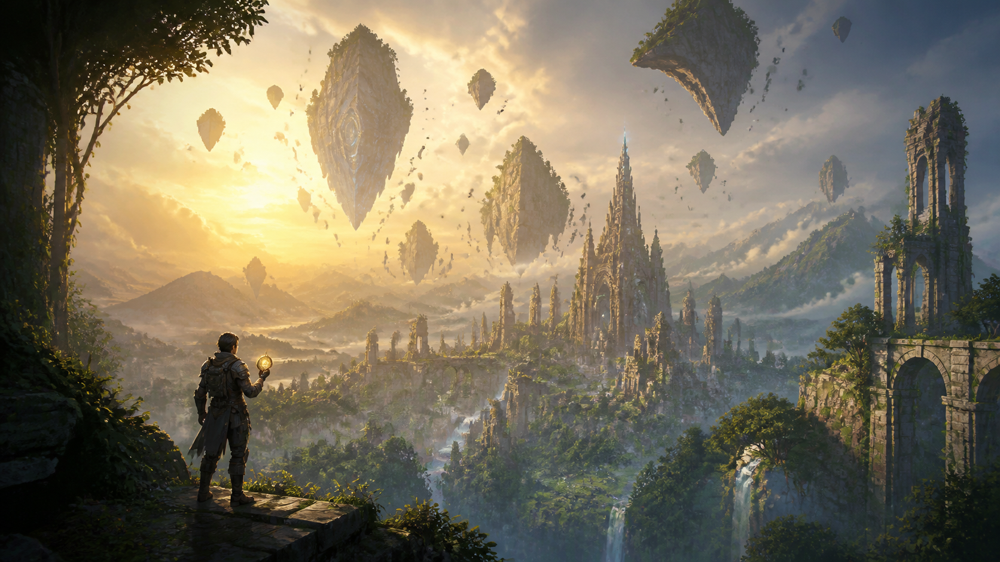
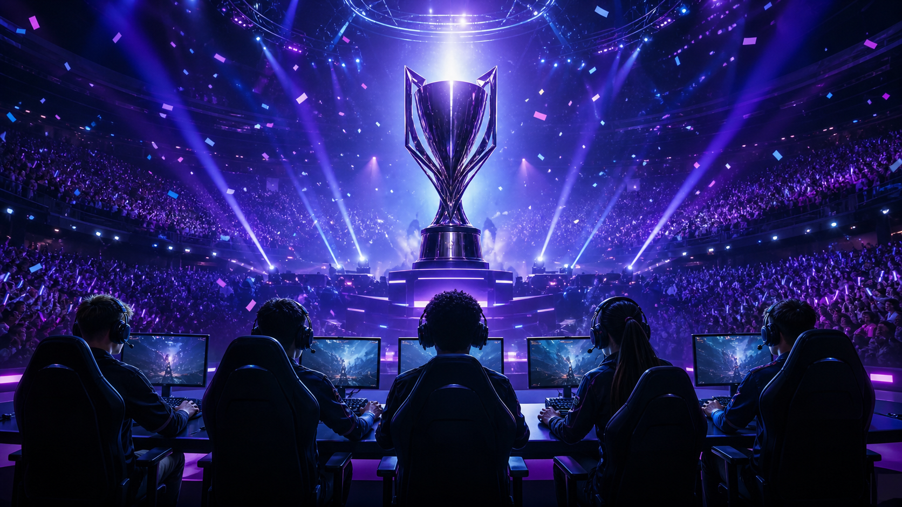
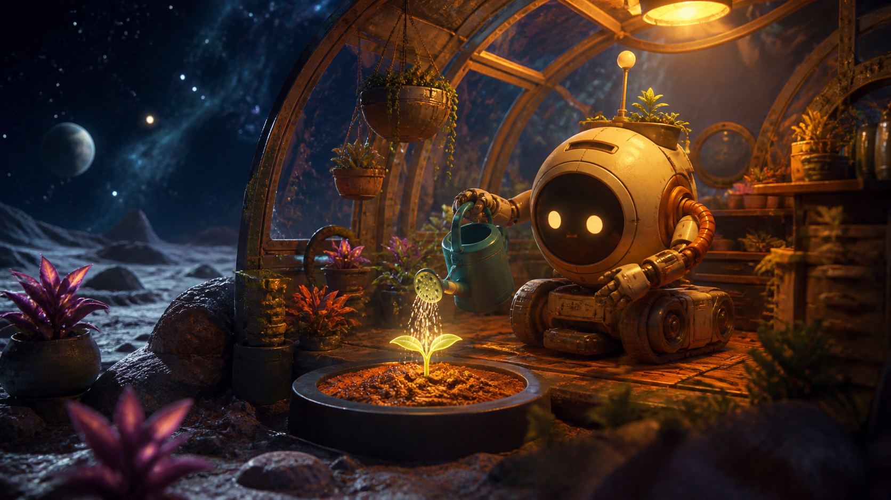
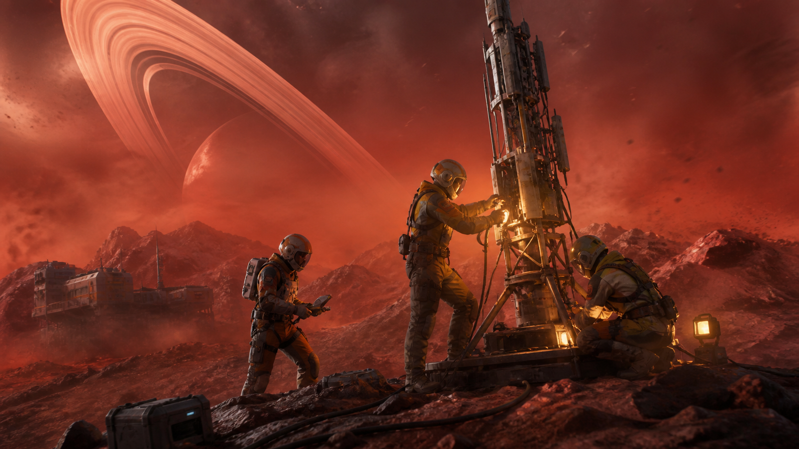

# Prompts para las noticias utilizadas

## Noticia No. 1

### Prompt para generar el texto

```text
Escribe una noticia ficticia en español para un portal académico de videojuegos sobre GTA 6. Enfoca el artículo en la expectativa por un mundo abierto que reaccione a las decisiones del jugador, las rutinas de los habitantes y las historias emergentes. Incluye un título periodístico, una categoría, un resumen de una oración y tres párrafos breves. Mantén un tono informativo, coherente y prudente; no presentes rumores ni fechas no confirmadas como hechos.
```

### Prompt para generar la imagen

```text
Genera una ilustración editorial cinematográfica en formato 16:9 para una noticia sobre la expectativa alrededor de GTA 6. Muestra una ciudad costera original al atardecer, palmeras, luces de neón, un automóvil deportivo y dos personajes adultos vistos de espaldas. Usa tonos coral, cian y magenta. La composición debe recordar a un videojuego moderno de mundo abierto sin copiar personajes ni arte promocional existente. Sin logotipos, títulos, texto, interfaz ni marcas de agua.
```

### Imagen generada


### Texto generado

- **Título:** GTA 6 y la promesa de un mundo que reacciona a cada decisión
- **Fecha:** 2026-08-08
- **Categoría:** Lanzamientos
- **Resumen:** La próxima gran ciudad abierta pone el foco en las historias emergentes, la vida urbana y una experiencia diseñada para sorprender en cada recorrido.
- **Aplicación de IA:** ChatGPT de OpenAI

La expectativa alrededor de GTA 6 no nace solamente del tamaño de su mapa. El verdadero atractivo está en la posibilidad de recorrer una ciudad que parezca tener memoria: peatones con rutinas, barrios con personalidades distintas y situaciones que cambian según la hora o las decisiones del jugador.

Un mundo abierto convincente no necesita llenar cada esquina de iconos. Necesita provocar curiosidad. Una conversación escuchada al pasar, un negocio que cambia al caer la noche o una tormenta que transforma el tráfico pueden convertir un trayecto cotidiano en una historia que el jugador sienta como propia.

El reto será equilibrar ese nivel de detalle con una narrativa clara. Si la tecnología, las misiones y los personajes trabajan en conjunto, GTA 6 puede demostrar que la nueva generación no se mide solo en resolución, sino en la capacidad de crear lugares digitales creíbles.

## Noticia No. 2

### Prompt para generar el texto

```text
Escribe una noticia ficticia en español sobre un videojuego de aventura llamado Reinos Fragmentados. Describe un mundo fantástico con ciudades flotantes, ruinas antiguas y una brújula mágica que fomenta la observación en lugar de marcar objetivos exactos. Incluye un título periodístico, una categoría, un resumen de una oración y tres párrafos breves. El contenido debe ser claro, apropiado para un portal informativo y destacar la exploración como recompensa.
```

### Prompt para generar la imagen

```text
Genera una ilustración cinematográfica en formato 16:9 para un videojuego fantástico original. Muestra a un explorador con armadura observando un gran valle verde con ruinas antiguas, cascadas y fragmentos de tierra flotando en el cielo. El personaje sostiene una brújula luminosa. Iluminación de amanecer dorado, sensación de aventura y misterio. Sin personajes reconocibles, logotipos, títulos, texto, interfaz ni marcas de agua.
```

### Imagen generada



### Texto generado

- **Título:** Reinos Fragmentados convierte la exploración en su mejor recompensa
- **Fecha:** 2026-08-06
- **Categoría:** Aventura
- **Resumen:** Ruinas suspendidas, rutas secretas y un sistema de brújula mágica dan forma a una aventura fantástica que confía en la curiosidad del jugador.
- **Aplicación de IA:** ChatGPT de OpenAI

Reinos Fragmentados imagina un territorio en el que antiguas ciudades flotan sobre valles cubiertos por vegetación. La misión principal guía el viaje, pero son los pequeños desvíos los que explican qué ocurrió con la civilización que habitó sus torres.

La brújula del protagonista no marca objetivos exactos. Reacciona a sonidos, cambios de luz y estructuras cercanas, de modo que cada hallazgo exige observar el entorno. Este enfoque evita que la exploración se convierta en una lista de tareas.

Con una dirección artística luminosa y combates breves, la propuesta busca que descubrir una nueva ruta sea tan satisfactorio como superar a un enemigo.

## Noticia No. 3

### Prompt para generar el texto

```text
Redacta una noticia ficticia en español sobre la final internacional de un videojuego competitivo llamado Arena Nexus. Explica cómo el torneo combina estrategia, coordinación, espectáculo y una transmisión fácil de entender para nuevas audiencias. Incluye un título periodístico, categoría Esports, un resumen de una oración y tres párrafos breves. Usa un tono informativo y evita mencionar equipos o marcas reales.
```

### Prompt para generar la imagen

```text
Genera una imagen editorial en formato 16:9 de una final internacional de esports ficticia. Muestra cinco jugadores originales sentados frente a sus computadoras, un gran trofeo en el centro, público y luces violetas y azules. La escena debe transmitir emoción, competencia y espectáculo profesional. No incluyas equipos reales, marcas, logotipos, texto legible, interfaz ni marcas de agua.
```

### Imagen generada



### Texto generado

- **Título:** Arena Nexus reúne estrategia y espectáculo en su final internacional
- **Fecha:** 2026-08-04
- **Categoría:** Esports
- **Resumen:** La competencia cerró su temporada con partidas ajustadas y una transmisión pensada para que las nuevas audiencias entiendan cada jugada.
- **Aplicación de IA:** ChatGPT de OpenAI

La final de Arena Nexus apostó por algo más que luces y un gran escenario. Antes de cada partida, la transmisión explicó las decisiones tácticas de los equipos con repeticiones sencillas y mapas que mostraban el control del terreno.

Ese esfuerzo hizo que las rondas decisivas fueran fáciles de seguir incluso para quienes no conocían todos los personajes. La serie se definió por la coordinación: ningún movimiento espectacular tuvo valor sin la información compartida por el resto del equipo.

El resultado fue una celebración competitiva accesible y emocionante, una buena señal para un circuito que quiere crecer sin perder profundidad.

## Noticia No. 4

### Prompt para generar el texto

```text
Escribe una noticia ficticia en español sobre un videojuego independiente llamado Brote Estelar. El protagonista es un pequeño robot jardinero que recupera un invernadero abandonado en una luna distante. Enfatiza su ritmo tranquilo, la relación entre las plantas y la historia del lugar, y su mensaje sobre cuidado y segundas oportunidades. Incluye título, categoría Indie, resumen y tres párrafos breves.
```

### Prompt para generar la imagen

```text
Genera una ilustración 3D en formato 16:9 para un videojuego independiente acogedor. Muestra a un pequeño robot jardinero original regando una planta luminosa dentro de un invernadero situado en una luna. Al fondo deben verse estrellas y otro planeta. Usa iluminación cálida ámbar en el interior y azul profundo en el espacio. Sin logotipos, títulos, texto, interfaz ni marcas de agua.
```

### Imagen generada



### Texto generado

- **Título:** Brote Estelar demuestra que una historia pequeña puede llegar muy lejos
- **Fecha:** 2026-08-01
- **Categoría:** Indie
- **Resumen:** Un robot jardinero y una semilla luminosa protagonizan una aventura tranquila sobre cuidado, paciencia y segundas oportunidades.
- **Aplicación de IA:** ChatGPT de OpenAI

En Brote Estelar no hay una cuenta regresiva ni un enemigo que derrotar. El jugador controla a un pequeño robot encargado de recuperar un invernadero abandonado en una luna distante.

Cada planta modifica el espacio: algunas producen luz, otras atraen criaturas y unas pocas revelan mensajes de la antigua tripulación. Las tareas sencillas de regar y ordenar se convierten así en una forma de reconstruir la historia del lugar.

Su ritmo calmado y su expresiva animación recuerdan que los videojuegos también pueden crear emoción mediante gestos mínimos y objetivos cotidianos.

## Noticia No. 5

### Prompt para generar el texto

```text
Redacta una noticia tecnológica ficticia en español sobre un concepto de consola portátil modular. Explica sus controles intercambiables, base de escritorio, perfiles de energía y posibles beneficios de accesibilidad. También menciona brevemente los retos de peso, temperatura y batería. Incluye un título periodístico, categoría Tecnología, resumen de una oración y tres párrafos breves. No utilices nombres de marcas reales.
```

### Prompt para generar la imagen

```text
Genera un render de producto en formato 16:9 de una consola portátil modular ficticia y sin marca. Colócala flotando sobre una base de escritorio, con controles intercambiables a los lados y una pantalla con formas abstractas de velocidad. Fondo de estudio oscuro, materiales color grafito e iluminación cian. Sin semejanza directa con productos reales, logotipos, texto ni marcas de agua.
```

### Imagen generada


### Texto generado

- **Título:** La consola portátil modular busca adaptarse a cada forma de jugar
- **Fecha:** 2026-07-29
- **Categoría:** Tecnología
- **Resumen:** Un concepto de hardware combina controles intercambiables, base de escritorio y perfiles de energía para unir movilidad y comodidad.
- **Aplicación de IA:** ChatGPT de OpenAI

El nuevo concepto de consola portátil modular parte de una pregunta sencilla: ¿por qué usar la misma distribución de botones para todos los géneros? Sus controles laterales pueden intercambiarse para priorizar precisión, accesibilidad o autonomía.

La base no pretende convertirla en una computadora distinta. Funciona como estación de carga, salida de video y punto de conexión para accesorios, manteniendo la misma biblioteca al cambiar de pantalla.

La idea todavía depende de un buen equilibrio entre peso, temperatura y duración de batería, pero muestra una dirección interesante para dispositivos que acompañan al jugador durante todo el día.

## Noticia No. 6

### Prompt para generar el texto

```text
Escribe una noticia ficticia en español sobre un videojuego cooperativo de ciencia ficción llamado Señal Roja. Tres exploradores deben reparar una estación científica durante una tormenta en un planeta rojo. Cada integrante tiene información y responsabilidades diferentes, por lo que la comunicación es la mecánica principal. Incluye título, categoría Cooperativo, resumen y tres párrafos breves con tono informativo.
```

### Prompt para generar la imagen

```text
Genera una ilustración cinematográfica en formato 16:9 de un videojuego cooperativo de ciencia ficción original. Muestra a tres exploradores espaciales reparando una antena de comunicaciones durante una tormenta de polvo en un planeta rojo. Incluye una estación dañada, montañas y grandes anillos planetarios en el cielo. Ambiente tenso pero esperanzador, con luces cálidas de trabajo. Sin armaduras reconocibles, logotipos, texto, interfaz ni marcas de agua.
```

### Imagen generada



### Texto generado

- **Título:** Señal Roja hace de la comunicación la herramienta más importante
- **Fecha:** 2026-07-26
- **Categoría:** Cooperativo
- **Resumen:** Tres exploradores deben reparar una estación en plena tormenta marciana, compartiendo recursos e información para sobrevivir.
- **Aplicación de IA:** ChatGPT de OpenAI

Señal Roja coloca a tres jugadores frente a una estación científica dañada. Cada integrante recibe información diferente: uno interpreta el clima, otro controla la energía y el tercero puede reparar los módulos exteriores.

Nadie posee la solución completa. Para restablecer la antena, el equipo debe describir símbolos, coordinar rutas y decidir cuándo vale la pena arriesgar recursos. La tensión surge de conversar con claridad, no de disparar más rápido.

Las partidas son cortas y los eventos cambian de posición, por lo que aprender a colaborar resulta más importante que memorizar un único procedimiento.
