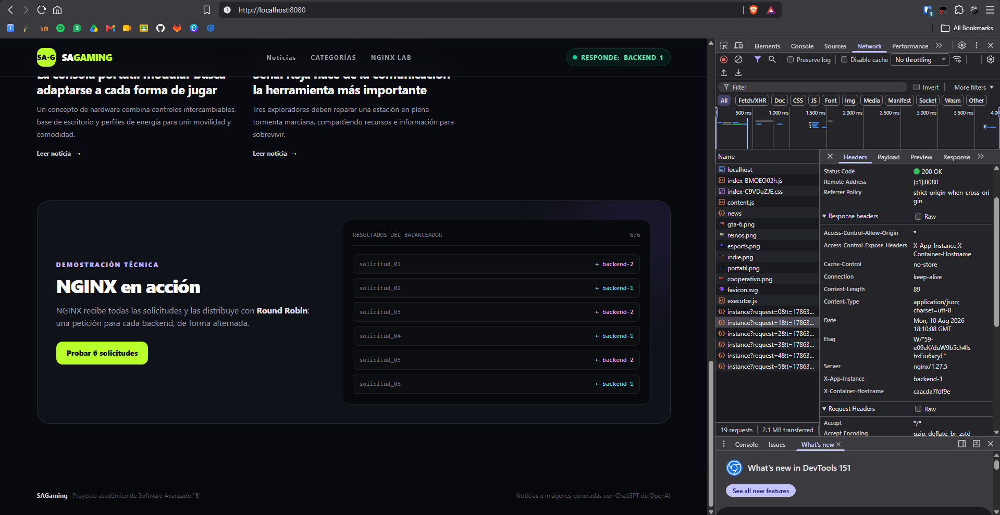
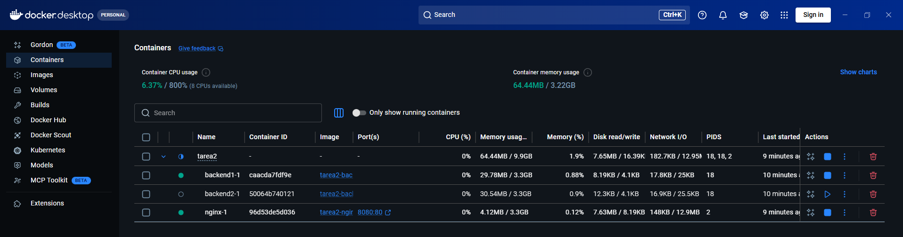
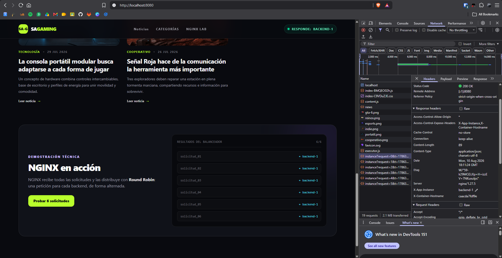

# Tarea 2: Portal de noticias con IA, Docker Compose y balanceo de carga con NGINX

SAGaming es un proyecto académico para publicar noticias de videojuegos y demostrar el funcionamiento de NGINX como enrutador, proxy inverso y balanceador de carga.

Las noticias son ficticias y fueron generadas o asistidas por inteligencia artificial.

## Tecnologías utilizadas

- **Frontend:** React, TypeScript, Vite y Tailwind CSS.
- **Backend:** Node.js, Express y TypeScript.
- **Infraestructura:** NGINX, Docker y Docker Compose.
- **Inteligencia artificial:** ChatGPT de OpenAI para los textose imágenes.

## Arquitectura de la solución

```text
Navegador
    │
    │ http://localhost:8080
    ▼
  NGINX
    ├── /              → Frontend React
    └── /api/*         → Balanceador Round Robin
                              ├── backend1:3000
                              └── backend2:3000
```

NGINX es el único servicio accesible desde la computadora. Los dos backends utilizan el puerto `3000` dentro de los contenedores Docker y se comunican mediante la red interna `portal-network`.

## Construir e iniciar los contenedores

Desde la carpeta `Tarea2`, ejecutar:

```bash
docker compose up --build -d
```

Para detenerlos:

```bash
docker compose down
```

## Dirección del portal

El portal está disponible en:

<http://localhost:8080>

## Rutas configuradas

| Ruta              | Propósito                                           |
| ----------------- | --------------------------------------------------- |
| `/`               | Página principal con el listado de noticias.        |
| `/noticias/:slug` | Consulta de una noticia individual.                 |
| `/api/news`       | Devuelve las seis noticias.                         |
| `/api/news/:slug` | Devuelve una noticia específica.                    |
| `/api/instance`   | Indica qué instancia atendió la solicitud.          |
| `/health`         | Comprueba el estado de los backends mediante NGINX. |

NGINX envía las rutas `/api/*` a los backends y entrega el frontend para las demás rutas.

## Algoritmo de balanceo

Se utiliza **Round Robin**, el algoritmo predeterminado de NGINX. Las solicitudes se distribuyen de forma alternada:

```text
Solicitud 1 → backend-1
Solicitud 2 → backend-2
Solicitud 3 → backend-1
Solicitud 4 → backend-2
```

Cada respuesta incluye el identificador de la instancia en el contenido y en el encabezado HTTP `X-App-Instance`.

## Comprobar el balanceo de carga

La forma más sencilla es abrir el portal y presionar el botón **Probar 6 solicitudes** de la sección **NGINX en acción**. Los resultados deben alternar entre `backend-1` y `backend-2`.

También se puede ejecutar varias veces:

```bash
curl -i http://localhost:8080/api/instance
```

Para comprobar que el portal continúa funcionando cuando falla una instancia:

```bash
docker compose stop backend1
curl -i http://localhost:8080/api/instance
docker compose start backend1
```

Mientras `backend1` está detenido, la solicitud debe responder desde `backend-2`.

## Aplicación de IA utilizada

- Los textos se generaron con **ChatGPT de OpenAI**.
- Las imágenes se generaron con **OpenAI ImageGen**.
- Los prompts y resultados están documentados en [PROMPTS.md](PROMPTS.md).

## Evidencias de funcionamiento

### Vista principal del sitio


### Balanceo entre las dos instancias



### Continuidad al detener un backend




